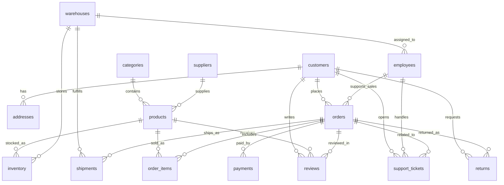

# Entity Relationship Diagram

```mermaid
erDiagram
  customers ||--o{ addresses : has
  customers ||--o{ orders : places
  customers ||--o{ reviews : writes
  customers ||--o{ support_tickets : opens
  customers ||--o{ returns : requests

  categories ||--o{ products : contains
  suppliers ||--o{ products : supplies

  products ||--o{ order_items : sold_as
  products ||--o{ inventory : stocked_as
  products ||--o{ reviews : receives

  warehouses ||--o{ inventory : stores
  warehouses ||--o{ shipments : fulfills
  warehouses ||--o{ employees : assigned_to

  employees ||--o{ orders : supports_sales
  employees ||--o{ support_tickets : handles

  orders ||--o{ order_items : includes
  orders ||--o{ payments : paid_by
  orders ||--o{ shipments : ships_as
  orders ||--o{ reviews : reviewed_in
  orders ||--o{ support_tickets : related_to
  orders ||--o{ returns : returned_as
```
