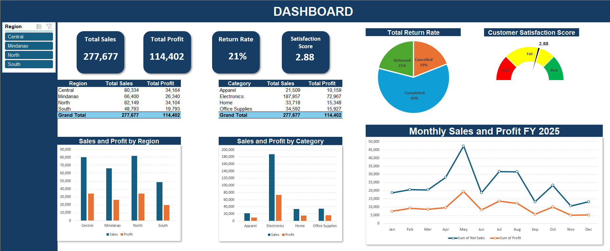

# Small Dummy Data Dashboard

Compact Excel dashboard project using sample retail-style data across transactions, customers, and products.

## Files

| File | Purpose |
|---|---|
| `Small Dummy Data (Dashboard).xlsx` | Main Excel workbook containing the dashboard, analysis, transactions, customers, products, and supporting summaries. |
| `small-dummy-data-dashboard-capture.png` | Dashboard preview image for GitHub. |
| `DATA_DICTIONARY.md` | Sheet catalog and key field descriptions. |
| `.gitignore` | Excludes local Excel lock files, OS files, editor folders, and generated exports. |
| `.gitattributes` | Marks workbook and image assets as binary files. |

## Workbook Structure

| Sheet | Purpose |
|---|---|
| `Dashboard` | Main visual dashboard. |
| `Analysis` | Business questions, insights, implications, and suggested actions. |
| `Transactions` | Transaction-level source dataset. |
| `Customers` | Customer reference table. |
| `Analyze` | Supporting summaries and visual elements. |
| `Products` | Product reference table. |

## Project Write-Up

### The Dataset

This project uses a compact synthetically generated sample dataset included directly in the workbook across the `Transactions`, `Customers`, and `Products` sheets. The dataset represents fictional retail-style transactions linked to customer and product reference tables, including order dates, customers, products, channels, payment methods, quantities, prices, discounts, costs, profit, order status, and satisfaction scores. It does not contain real customer, company, transaction, or personally identifiable information, and is safe to publish publicly. No external data connection is required.

### Methodology & Cleaning

The workbook structures the dataset into separate fact and lookup-style sheets: transaction records, customer records, and product records. This makes the data easier to validate, summarize, and analyze. The dashboard and analysis sheets use cleaned transaction fields and supporting summaries to report sales, profit, return rate, order status, satisfaction, region performance, and product category performance. Typical preparation steps for this workbook include removing duplicate order IDs, standardizing customer and product IDs, cleaning text with `TRIM` and `PROPER`, formatting dates consistently, checking numeric fields such as quantity, price, discount, cost, and profit, and using the customer and product sheets as controlled reference tables.

### Formulas & Functions

Advanced Excel features used in this workbook include Excel tables, pivot tables, dashboard charts, customer and product reference tables, and summary calculations. Formula patterns found in the workbook include `AVERAGEIF`, along with pivot-table based aggregation for sales, profit, returns, satisfaction, regions, and categories.

## How to Use

1. Download or clone this repository.
2. Open `Small Dummy Data (Dashboard).xlsx` in Microsoft Excel.
3. Start with the `Dashboard` sheet for the visual summary.
4. Review `Analysis` for business interpretation and recommended actions.
5. Use `Transactions`, `Customers`, and `Products` for validation or deeper exploration.

## Data Notes

- The workbook includes its own sample source data.
- No external data connection is required based on the included workbook structure.
- Dates may appear as Excel serial dates when inspected outside Excel.

## License

This project is licensed under the [Creative Commons Attribution 4.0 International License](LICENSE), allowing reuse and adaptation with attribution.
