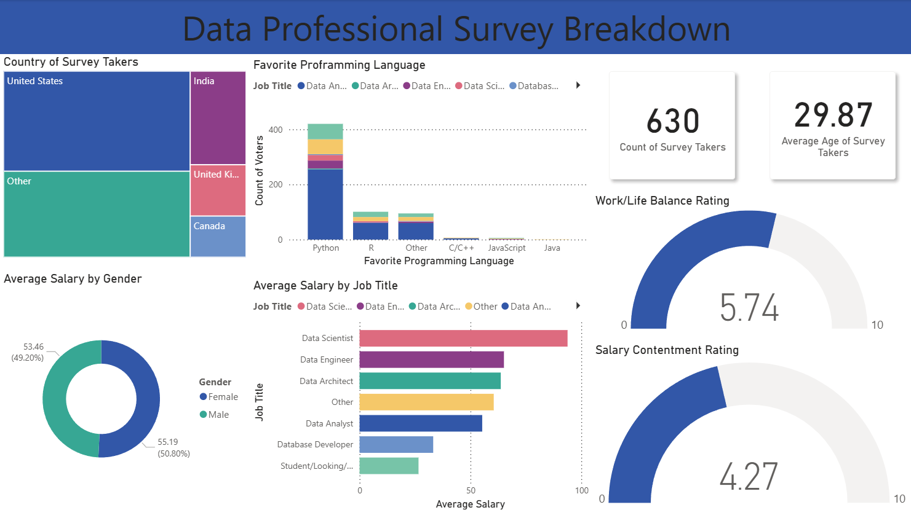

# Data Professional Survey Dashboard - Power BI

## Overview
I built this Power BI dashboard to explore survey responses from data professionals. The report looks at job roles, salary bands, favorite programming languages, career switching, job-search priorities, location, demographics, and workplace satisfaction.

## Business Problem
I wanted to turn the raw survey data into a dashboard that makes it easier to understand who is working in data, what tools they prefer, how they entered the field, and what matters most to them in their current or next role.

## Dashboard Preview


## Demo
There is no public Power BI Service link included for this project.

You can review the report locally in [report/dashboard.pbix](report/dashboard.pbix), or view the walkthrough GIF here: [demo/dashboard-walkthrough.gif](demo/dashboard-walkthrough.gif).

## Key Insights
- The dataset includes 630 survey responses and 28 columns.
- Data Analyst is the most common role in the survey, with 381 respondents.
- 372 respondents said they switched careers into data, while 258 did not.
- Python is the most popular favorite programming language, with 420 responses.
- Better Salary is the top priority when looking for a new job, followed by Remote Work and Good Work/Life Balance.
- The average respondent age is 29.9 years.
- Coworkers received the highest average satisfaction score at 5.86, while Salary had the lowest at 4.27.

## Tools Used
- Power BI
- Power Query
- DAX / Power BI aggregations
- Excel
- CSV

## Data Model
The report is based on one survey table named `Data Professional Survey`.

The Power BI file also includes a transformed `Average Salary` field that is used in the visuals. I documented the model details in [docs/data-model.md](docs/data-model.md).

## DAX Measures
I added the observed calculations and reusable DAX patterns in [docs/dax-measures.md](docs/dax-measures.md).

## Project Structure
```text
data-professional-survey/
|-- .gitignore
|-- LICENSE
|-- README.md
|-- screenshots/
|   `-- overview.png
|-- demo/
|   `-- dashboard-walkthrough.gif
|-- report/
|   `-- dashboard.pbix
|-- data/
|   |-- sample_data.csv
|   |-- data_dictionary.md
|   `-- Data Professional Survey.xlsx
|-- docs/
|   |-- business-requirements.md
|   |-- dax-measures.md
|   `-- data-model.md
```
