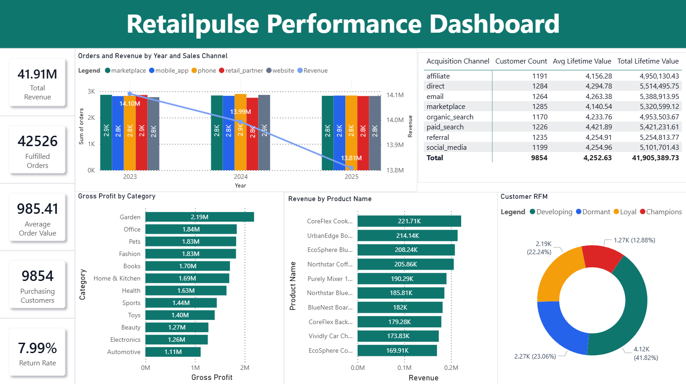
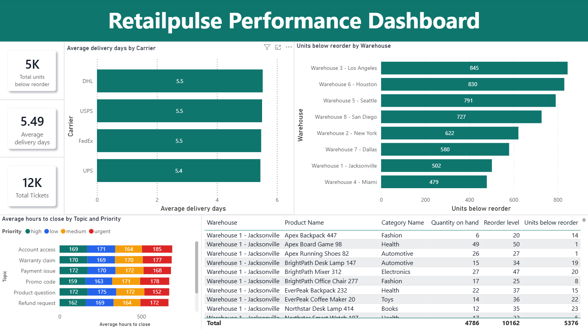

# RetailPulse Power BI Dashboard

This is the Power BI dashboard I built on top of my [RetailPulse MySQL ecommerce project](../../sql-projects/retailpulse-ecommerce-sql-portfolio). I used the SQL project as the base, then exported a smaller set of dashboard-ready CSV files for the report.

The goal was to turn the SQL analysis into something easier to scan visually: sales trends, product and category performance, customer value, RFM segments, shipping performance, inventory reorder items, returns, and support ticket resolution.

The data is synthetic, so it is safe to publish. I did not include any real customer data.





## Folder Structure

```text
.
|-- data/                         # Dashboard-ready CSV extracts
|-- demo/
|   `-- dashboard-walkthrough.gif  # Short dashboard preview
|-- docs/
|   |-- dashboard_data_dictionary.md
|   |-- data_lineage.sql           # SQL used to reproduce dashboard extracts
|   `-- measures.dax              # Main Power BI measures
|-- report/
|   `-- dashboard.pbix            # Power BI Desktop report
|-- screenshot/
|   |-- dashboard-page1-capture.png
|   `-- dashboard-page2-capture.png
|-- .gitattributes
|-- .gitignore
`-- README.md
```

## What I Included

| Area | What I looked at |
|---|---|
| Executive KPIs | fulfilled orders, revenue, average order value, purchasing customers, returns, and return rate |
| Sales | monthly revenue and order trends by sales channel |
| Products | product revenue, units sold, estimated cost, and gross profit |
| Categories | category revenue, gross profit, gross margin, fulfilled orders, returns, and refunds |
| Customers | lifetime value, average order value, last order date, acquisition channel, segment, and RFM group |
| Operations | delivery performance by warehouse, carrier, and shipping method |
| Inventory | product and warehouse combinations below reorder level |
| Support | ticket volume, closed tickets, and average resolution hours by topic, priority, and status |

## Dashboard Data

The report uses these CSV extracts from the [SQL project](../../sql-projects/retailpulse-ecommerce-sql-portfolio):

| File | Rows | Grain |
|---|---:|---|
| `kpi_summary.csv` | 1 | one overall KPI summary row |
| `sales_monthly_channel.csv` | 180 | one row per month and sales channel |
| `product_performance.csv` | 500 | one row per product |
| `category_performance.csv` | 12 | one row per category |
| `customer_lifetime_value.csv` | 9,854 | one row per purchasing customer |
| `customer_rfm_segments.csv` | 9,854 | one row per purchasing customer |
| `delivery_performance.csv` | 128 | one row per warehouse, carrier, and shipping method |
| `inventory_reorder.csv` | 288 | one row per product and warehouse below reorder level |
| `support_resolution.csv` | 160 | one row per topic, priority, and ticket status |

Main numbers from the extracts:

- Fulfilled orders: 42,526
- Revenue: 41,905,389.73
- Average order value: 985.41
- Purchasing customers: 9,854
- Returns: 3,399
- Return rate: 7.99%
- Sales period: January 2023 through December 2025
- Sales channels: marketplace, mobile_app, phone, retail_partner, website
- RFM segments: Champions, Loyal, Developing, Dormant

## Link To The SQL Project

This dashboard goes with my MySQL project: [retailpulse-ecommerce-sql-portfolio](../../sql-projects/retailpulse-ecommerce-sql-portfolio).

That project has the normalized source CSVs, MySQL schema, load scripts, data checks, ERD, and the SQL analysis queries. For this Power BI repo, I kept the smaller transformed extracts in `data/` so the PBIX can be opened without connecting to MySQL first.

If I need to rebuild the extracts, I can load the [SQL project](../../sql-projects/retailpulse-ecommerce-sql-portfolio) and run `docs/data_lineage.sql` against the `retailpulse_analytics` database.

## How To Open It

1. Open `report/dashboard.pbix` in Power BI Desktop.
2. If Power BI prompts for file paths, point each query to the matching CSV in this repo's `data/` folder.
3. The main measures are listed in `docs/measures.dax`.
4. The SQL used to rebuild the extracts is in `docs/data_lineage.sql`.

## Notes

- The dataset is synthetic and made for this portfolio project.
- Gross profit is an estimate using `line_total - quantity * unit_cost`.
- I treated `shipped`, `delivered`, and `refunded` orders as fulfilled for the dashboard extracts.
- I only used data that exists in the [SQL project](../../sql-projects/retailpulse-ecommerce-sql-portfolio) or the dashboard extracts. I did not fill missing values with made-up data.
